# UTM Command Dashboard · v10

> **India Urban Air Mobility Research Project — IIT Bombay**
> An analytics dashboard for the UTM Geo Corridor Simulator.
> Visualises drone flight simulation data across 8 pages covering
> airspace, safety, fleet health, temporal patterns, ML-based
> risk prediction, algorithm diagnostics, and cross-trial intelligence.

---

## Login & Landing

Connect to your simulation data via PostgreSQL or by uploading a run Excel file.

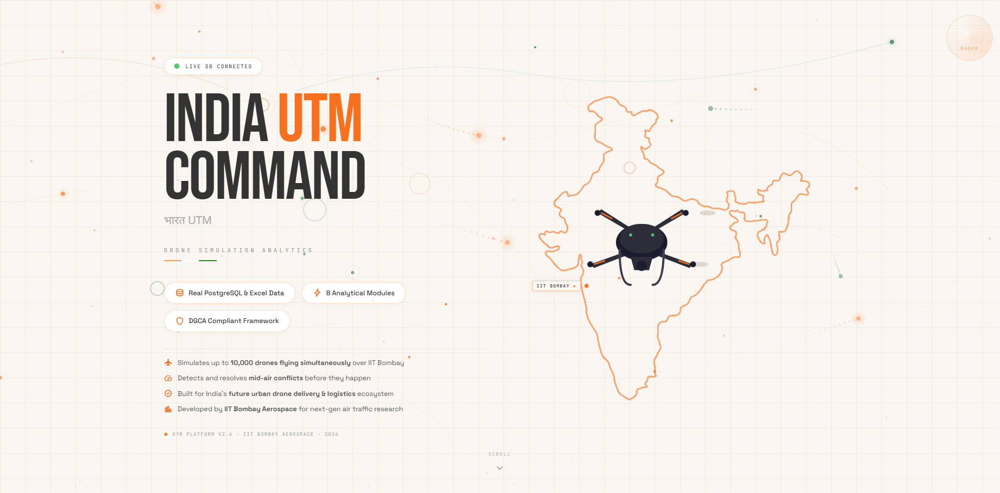

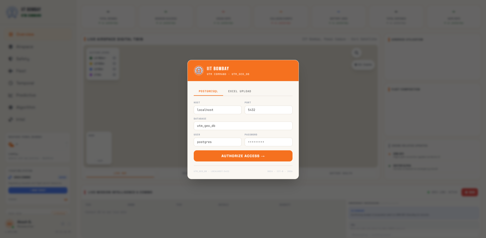


---

## Dashboard Pages

### 1 · Overview

Top-level KPIs, flight outcome breakdown, collision event log, vehicle and layer distribution, and per-path-run comparison.

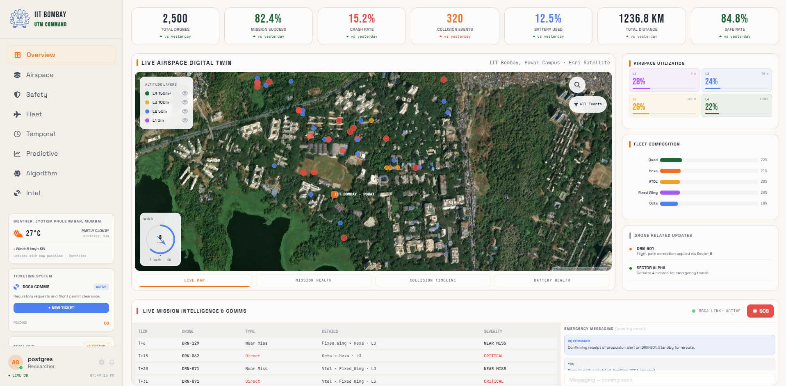

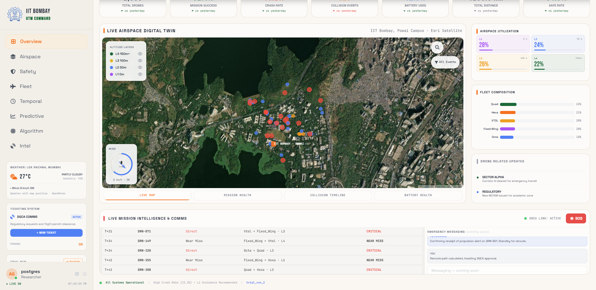

---

### 2 · Airspace

Leaflet satellite map of IIT Bombay campus with real drone positions and collision markers. Layer toggles, vehicle-type filter, altitude-layer filter, and Nominatim location search. Charts: layer distribution bar, vehicle count bar, flight status donut, collisions-by-layer stacked bar, drone density grid, fleet occupancy gauge.

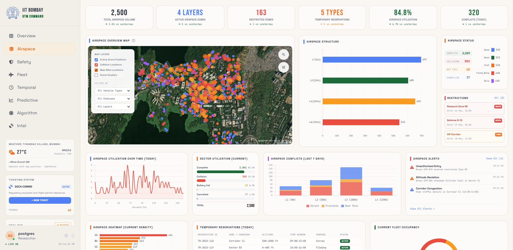

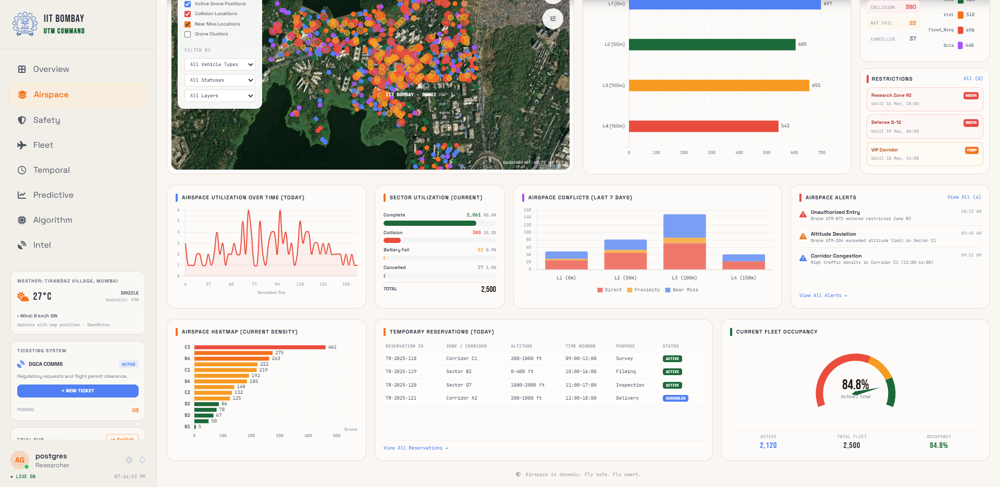

---

### 3 · Safety

Severity breakdown donut, vehicle collision rate dual-axis bar, battery-level-at-crash histogram with KDE overlay, layer safety profile grouped bar, vehicle × layer crash heatmap, collision pair types bar, vehicle performance comparison.

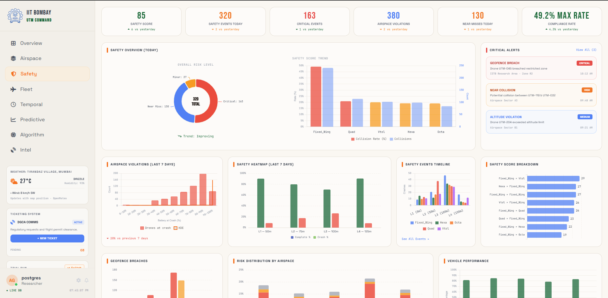

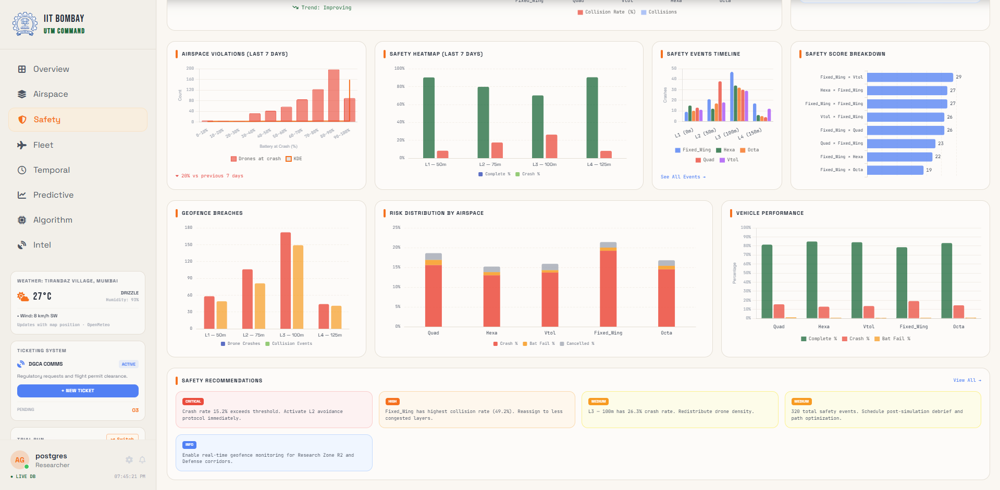

---

### 4 · Fleet

Flight status funnel bar, battery KDE curves (start / consumed / end), vehicle type donut, average distance by vehicle bar, battery KDE by flight status, battery reserve per altitude layer, distance-vs-battery scatter.

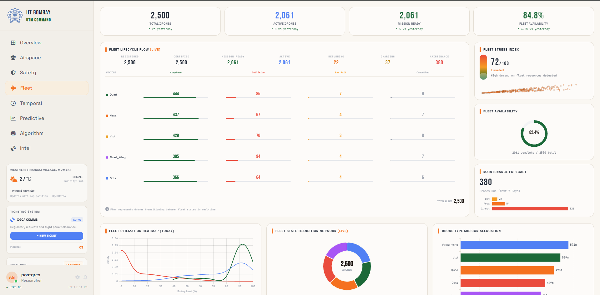

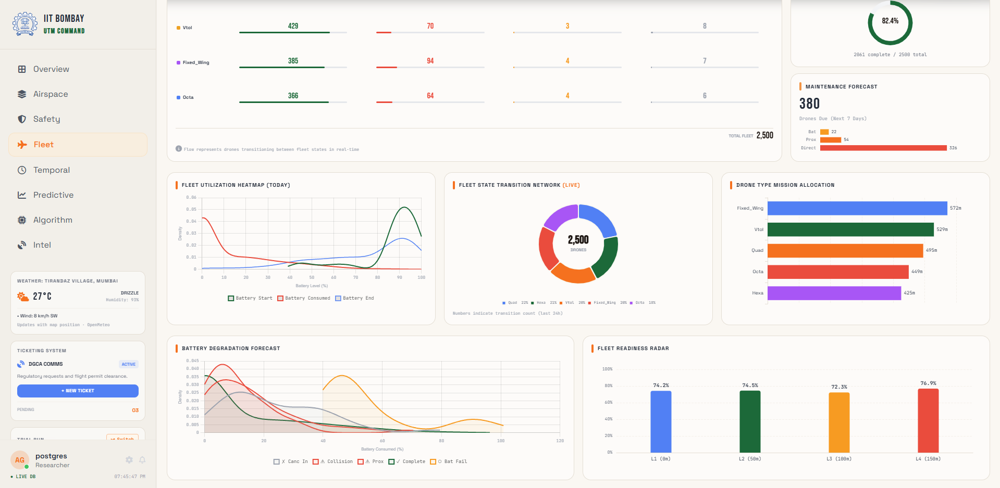

---

### 5 · Temporal

Airborne drones over simulation ticks, collision type × layer heatmap, flight status duration donut with median label, vehicle collision involvement pie, rolling collision rate (raw + 5-tick rolling average), severity over tick windows, collision rate vs airborne dual-axis.

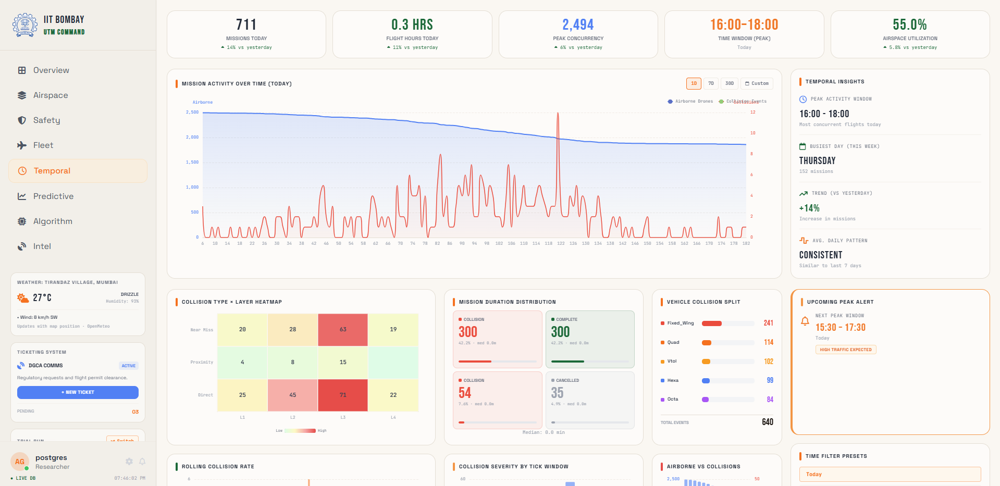

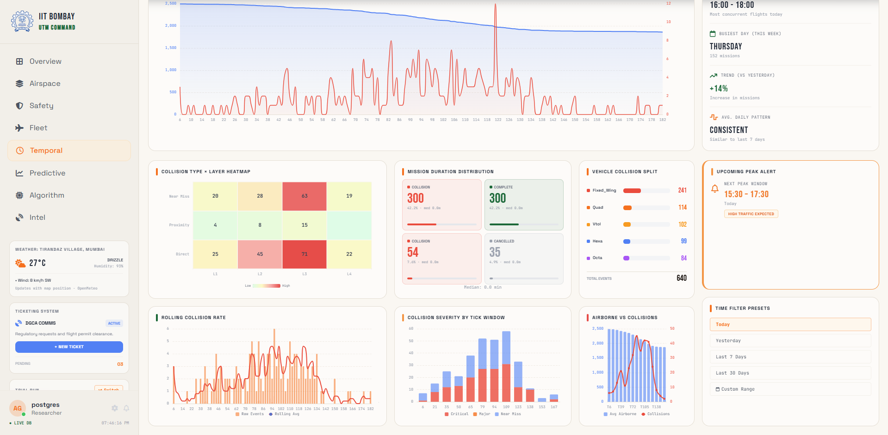

---

### 6 · Predictive (ML Risk)

Random Forest risk tier distribution, feature importance bar, per-drone risk score scatter on map coordinates, confusion matrix metrics table, vehicle performance radar, conflict escalation list.

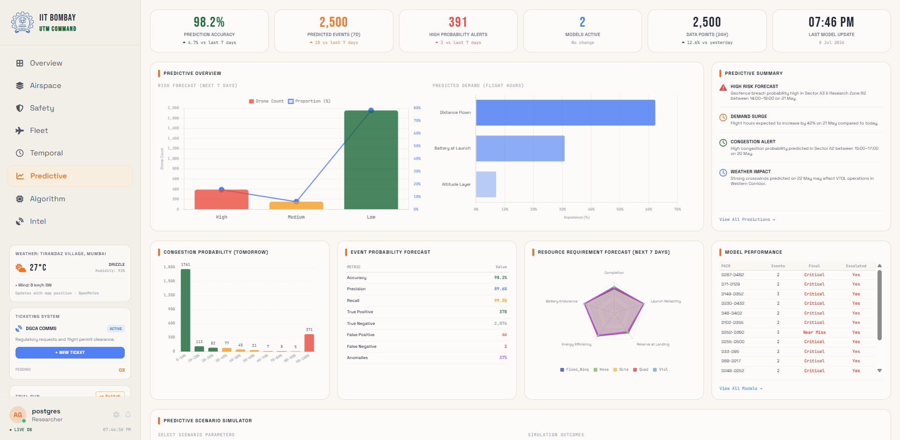

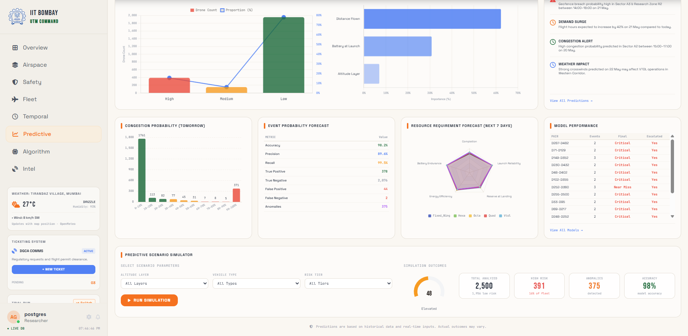

---

### 7 · Algorithm Diagnostics

Route assignment distance vs crash rate dual-axis, crashed vs safe route length distribution, per-layer crash and avoidance-failure rate, risk quadrant pie, vehicle pair collision heatmap, escalated drone pairs table, collision severity breakdown.

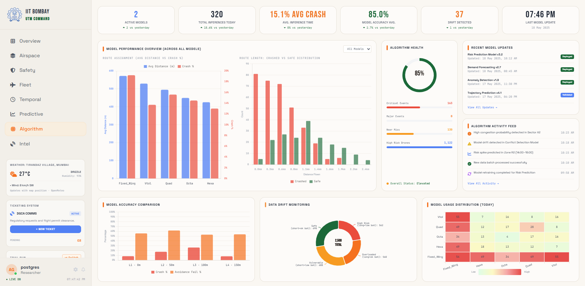

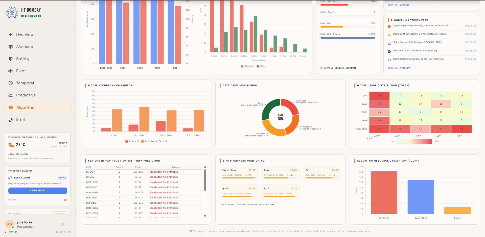

---

### 8 · Multi-Trial Intel

Cross-trial Leaflet map, trial collision-rate donut, fleet distribution donut, completion rate vs collision rate timeline, completion bars per trial, trial × metric heatmap (completion, collision rate, battery, efficiency, high-risk drones).

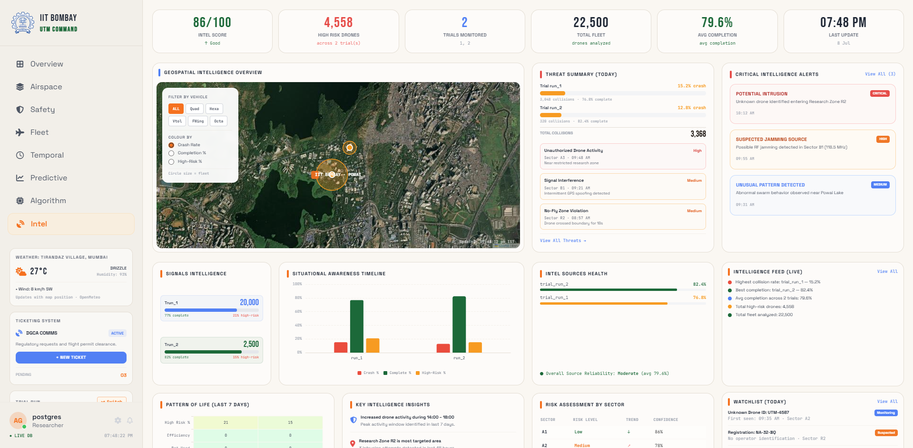

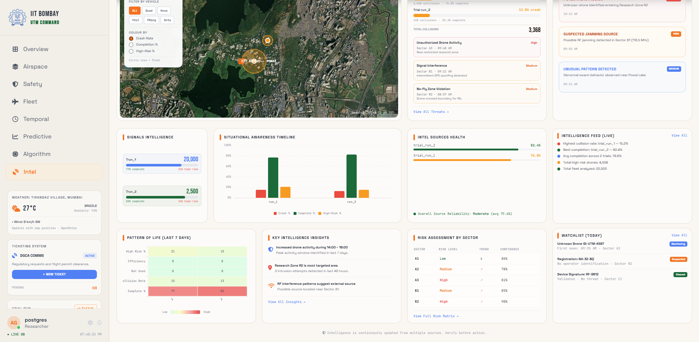

---

## Tech Stack

### Backend

| Component | Version | Role |
|-----------|---------|------|
| Python | 3.11+ | Runtime |
| FastAPI | ≥ 0.111 | Web framework — API routes, static file serving |
| Uvicorn | ≥ 0.29 | ASGI server |
| Pandas | ≥ 2.0 | Data loading, filtering, aggregation |
| NumPy | ≥ 1.24 | Numeric operations, NaN/Inf handling |
| SciPy | ≥ 1.11 | Gaussian KDE for battery distribution curves |
| scikit-learn | ≥ 1.3 | Random Forest risk scorer + Isolation Forest anomaly detection |
| openpyxl | ≥ 3.1 | Excel workbook parsing |
| SQLAlchemy | ≥ 2.0 | PostgreSQL connection |
| psycopg2-binary | ≥ 2.9 | PostgreSQL driver |
| python-multipart | ≥ 0.0.9 | File upload handling in FastAPI |

### Frontend

| Component | Version | Role |
|-----------|---------|------|
| HTML / CSS / Vanilla JS | — | Single-page application, no build step |
| Tailwind CSS | CDN | Utility-first layout and spacing |
| ECharts | 5 (CDN) | Bar, line, pie, scatter, gauge, heatmap, radar charts |
| Chart.js | latest (CDN) | Canvas-based bar and line charts |
| Leaflet | 1.9.4 (CDN) | Interactive satellite maps — IIT Bombay campus |
| ESRI World Imagery | CDN tile layer | Satellite basemap |
| Font Awesome | CDN | Icon set |
| Google Fonts | CDN | Space Grotesk, JetBrains Mono, Bebas Neue |
| Nominatim (OpenStreetMap) | API | Location search autocomplete on maps |
| OpenMeteo | API | Live weather data for IIT Bombay |

### Design System

| Token | Value |
|-------|-------|
| Background | `#FAF7F2` warm ivory |
| Brand accent (orange) | `#FF6B00` |
| Brand success (green) | `#046A38` |
| Brand blue | `#3B82F6` |
| Glass-panel border | `#E5DED4` |
| Primary font | Space Grotesk |
| Monospace font | JetBrains Mono |
| Display font | Bebas Neue |

---

## Project Structure

```
utm_v10_FINAL/
│
├── main.py                         FastAPI backend — loaders, enrichment,
│                                   data builders, all API routes (896 lines)
│
├── requirements.txt                Python dependencies
│
├── frontend/
│   ├── index.html                  Single HTML shell — all 8 page panels
│                                   live here as hidden divs (2203 lines)
│   │
│   ├── india-white.jpg             Background mural image
│   │
│   ├── css/
│   │   └── utm.css                 Design tokens, glass-panel cards,
│   │                               typography, responsive layout
│   │
│   └── js/
│       ├── api.js                  All fetch() calls to the FastAPI backend
│       │                           — one method per API endpoint (39 lines)
│       │
│       ├── app.js                  Application state (S object), login modal,
│       │                           nav routing, trial / path-run selector,
│       │                           _loadPage(), _render() (323 lines)
│       │
│       ├── map.js                  Leaflet overview map — satellite tiles,
│       │                           IIT Bombay labels, collision dot plots,
│       │                           Nominatim search, filter panel (194 lines)
│       │
│       ├── charts/
│       │   └── overview-charts.js  Chart.js renderers used exclusively by
│       │                           the Overview page (343 lines)
│       │
│       └── pages/
│           ├── overview.js         Overview page orchestrator (38 lines)
│           ├── airspace.js         Airspace map + 7 charts (700 lines)
│           ├── safety.js           Safety analytics — 7 charts (316 lines)
│           ├── fleet.js            Fleet health — 7 charts (352 lines)
│           ├── temporal.js         Temporal analytics — 7 charts (232 lines)
│           ├── predictive.js       ML Risk — 6 charts + metrics (387 lines)
│           ├── algo.js             Algorithm diagnostics — 8 charts (324 lines)
│           └── intel.js            Multi-trial intelligence — map + 5 charts (389 lines)
│
└── docs/
    ├── ARCHITECTURE.md             End-to-end data flow, column normalisation,
    │                               coordinate system, file responsibilities
    ├── DATA_FORMAT.md              Exact Excel sheet format and PostgreSQL
    │                               schema with column names
    └── screenshots/                Screenshots of every page
```

---

## Quick Start

### 1. Clone

```bash
git clone https://github.com/<your-username>/utm-command-dashboard.git
cd utm-command-dashboard
```

### 2. Install Python dependencies

```bash
python -m venv .venv
source .venv/bin/activate        # Windows: .venv\Scripts\activate
pip install -r requirements.txt
```

> `scikit-learn` is optional. If not installed, the Predictive and Algorithm
> pages return `{"error": "scikit-learn not installed"}` and all other pages
> continue to work normally.

### 3. Start the server

```bash
python main.py
```

The server starts on **http://127.0.0.1:8000**

### 4. Connect your data

Open the browser. On the login screen choose one of:

**PostgreSQL** — enter your host, port, database name, user, and password.
The default values point to `localhost:5432 / utm_geo_db / postgres`.

**Excel upload** — click "Upload Excel File" and select your simulation
workbook. The workbook must have sheets named `Run 1 — label`,
`Run 2 — label`, … and a `Collision Log` sheet.
See [`docs/DATA_FORMAT.md`](docs/DATA_FORMAT.md) for the exact column names.

### 5. Explore

Select a trial from the dropdown in the sidebar. Click any path-run button
to filter, or use "All" to see the full trial. Navigate between pages using
the sidebar links.

---

## API Endpoints

All endpoints are served by `main.py` at `http://127.0.0.1:8000`.

| Method | Path | Called by | Returns |
|--------|------|-----------|---------| 
| `POST` | `/api/connect/postgres` | Login modal | `{ok, trials, source}` |
| `POST` | `/api/connect/excel` | Login modal | `{ok, trials, source}` |
| `GET` | `/api/trials` | Sidebar on connect | `{trials, source}` |
| `GET` | `/api/trial/{tid}/path_runs` | Sidebar path-run buttons | `{path_runs, labels}` |
| `GET` | `/api/trial/{tid}/kpis` | (internal) | KPI dict |
| `GET` | `/api/trial/{tid}/overview` | Overview page | kpis, outcomes, vehicles, layers, coll_log, path_run_comparison, collision_pairs |
| `GET` | `/api/trial/{tid}/spatial` | Airspace page | drones[], conflicts[] |
| `GET` | `/api/trial/{tid}/safety` | Safety page | kpis, severity, vehicle_hits, bat_kde, layer_stats, vehicle_perf, collision_pairs, vehicle_crash_layer, escalation |
| `GET` | `/api/trial/{tid}/fleet` | Fleet page | kpis, bat_kde, bat_kde_by_status, fleet_funnel, bat_drain_points, bat_reserve_layer, vehicle_perf, path_run_battery, layer_crash_trend, vehicle_crash_layer |
| `GET` | `/api/trial/{tid}/temporal` | Temporal page | rolling_rate, fleet_density, dur_by_status, coll_by_tick |
| `GET` | `/api/trial/{tid}/ml_risk` | Predictive page | ml{}, vehicle_radar, conflict_escalation |
| `GET` | `/api/trial/{tid}/algo_diag` | Algorithm page | route_assignment, separation_events, escalated_count, failed_pairs, route_crash_dist, risk_quadrant, layer_fail |
| `GET` | `/api/multitrail_intel` | Intel page | trials[], n_trials |

All `GET /api/trial/...` endpoints accept an optional `?path_runs=1,2,3`
query parameter to filter to specific path runs.

---

## Key Design Decisions

**No build step.** The frontend is plain HTML + JS loaded directly from the
filesystem via FastAPI's `StaticFiles`. There is no webpack, Vite, or npm.
All libraries are loaded from CDN in `index.html`.

**Single in-memory session.** All data is loaded once on connect into two
Pandas DataFrames held in the global `_S` dict. Every API endpoint filters
those DataFrames — there are no further database queries during a session.

**All charts use live data only.** No hardcoded values, no mock arrays,
no `Math.random()` fallbacks. If a field is missing or null, the chart
shows an empty-state message.

**One HTML file.** All 8 page panels exist in `index.html` as hidden `<div>`
elements. `app.js` shows the active panel and hides the rest on nav click.

---

## Research Context

This dashboard was built for the **UTM Geo Corridor Simulator** at IIT Bombay
as part of Urban Air Mobility (UAM) research. The simulator generates
multi-vehicle drone flight trials across altitude-separated corridors and
records collision events, battery consumption, and route efficiency.

The dashboard allows researchers to:
- Compare flight outcomes across path runs and trials
- Identify collision hotspots on a geo-accurate campus map
- Analyse battery drain and fleet composition patterns
- Predict high-risk drones using a Random Forest trained on each trial's data
- Diagnose route assignment fairness and avoidance algorithm failures
- Compare trial configurations side by side in the Intel view

---

## License

MIT — see `LICENSE` for details.
